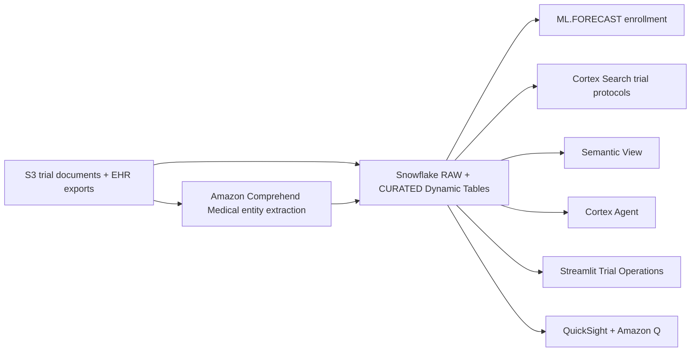

# Clinical Trial Operations & Patient Recruitment

End-to-end demo showing how Snowflake + AWS accelerate clinical trial enrollment forecasting, patient matching, and site performance monitoring.

## Architecture

A clinical trial operations and patient recruitment platform built on **Snowflake** (Dynamic Tables, ML.FORECAST, Cortex Search, semantic view, Cortex Agent) and **AWS** (S3, Comprehend Medical, QuickSight + Amazon Q). Trial documents land in S3; Comprehend Medical extracts entities; Snowflake forecasts enrollment and matches patients; the coordinator drives the trial from Streamlit while leadership reads QuickSight.



## Snowflake Capabilities

| Capability | Implementation |
|-----------|---------------|
| Dynamic Tables | RAW → CURATED pipeline with 5-min refresh |
| ML Functions | ML.FORECAST enrollment predictions by trial/site |
| Cortex Search | 100 trial protocol documents indexed |
| Cortex Agent | ClinicalTrialsAnalyst + ProtocolSearch tools |
| Semantic View | Structured analytics over enrollment, sites, visits |
| Streamlit | Multi-page trial operations dashboard |

## AWS Services

| Service | Role in Demo |
|---------|-------------|
| Amazon S3 | Landing zone for trial documents and EHR exports |
| Amazon Comprehend Medical | Entity extraction from clinical text (NER) |
| Amazon QuickSight | Executive enrollment dashboard with direct query |
| Amazon Q | Natural language analytics for VP Clinical Development |

## Personas

| Persona | Role | Key Questions |
|---------|------|---------------|
| **Clinical Operations Manager** | Monitors enrollment, manages site performance | "Which sites are behind target?" "How many eligible patients can we match?" |
| **VP Clinical Development** | Strategic decisions, portfolio view | "Will we hit enrollment milestones?" "Which trials need intervention?" |

## Data

| Table | Rows | Description |
|-------|------|-------------|
| TRIALS | 50 | Active clinical trials across therapeutic areas |
| SITES | 15 | APJ hospital sites with geo coordinates |
| PATIENTS | 10,000 | Patient demographics and medical history |
| ENROLLMENTS | 5,000 | Patient enrollment records across trials |
| VISITS | 20,000 | Scheduled and completed patient visits |
| ADVERSE_EVENTS | 2,000 | Safety event records |
| ELIGIBILITY_CRITERIA | 500 | Trial inclusion/exclusion criteria |
| PROTOCOL_DOCUMENTS | 100 | Trial protocol documents for search |

## Build Instructions

### Prerequisites
- Snowflake account with ACCOUNTADMIN access
- Cortex AI enabled (ML Functions, Search, Agent)
- Warehouse: CORTEX (Medium)
- AWS CLI with Comprehend Medical, QuickSight access

### Deployment

```bash
snowsql -f snowflake/00_setup.sql
snowsql -f snowflake/01_integrations.sql
snowsql -f snowflake/02_raw_tables.sql
snowsql -f snowflake/03_curated.sql
snowsql -f snowflake/04_search.sql
snowsql -f snowflake/05_ml.sql
snowsql -f snowflake/06_semantic.sql
snowsql -f snowflake/07_agent.sql
```

### Streamlit App
```
HEALTHCARE_CLINICAL_TRIALS.APP.TRIAL_OPERATIONS_APP
```

## Build Modes

### Snowflake Only
Run the SQL scripts in `snowflake/` (skip `01_integrations.sql`) and deploy the Streamlit app from `streamlit/deploy/`. Uses Cortex AI instead of Bedrock, and Snowflake Intelligence instead of QuickSight.

### Full AWS + Snowflake
Run all SQL scripts including `01_integrations.sql`, deploy the main Streamlit app from `streamlit/`, then run the QuickSight setup from `quicksight/`.

## Key Demo Numbers

- **CARDIO-PREVENT-301** at 31% enrollment (1,054/3,400) — board meeting in 6 weeks
- **SGH site** at 93% target vs **TTH** at 15%
- **18-month shortfall** predicted by ML model
- **100 protocol documents** indexed for Cortex Search

## License

Apache 2.0 — See [LICENSE](LICENSE) for details.
