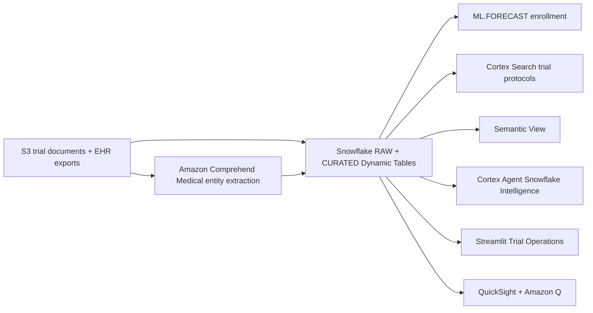

# Clinical Trial Operations & Patient Recruitment

End-to-end demo showing how Snowflake + AWS accelerate clinical trial enrollment forecasting, patient matching, and site performance monitoring.

## Architecture

A clinical trial operations and patient recruitment platform built on **Snowflake** (Dynamic Tables, ML.FORECAST, Cortex Search, semantic view, Cortex Agent) and **AWS** (S3, Comprehend Medical, QuickSight + Amazon Q). Trial documents land in S3; Comprehend Medical extracts entities; Snowflake forecasts enrollment and matches patients; the coordinator drives the trial from Streamlit while leadership reads QuickSight.




## What It Does

| Capability | Technology |
|---|---|
| Real-time site enrollment tracking | Dynamic Tables (SITE_PERFORMANCE) |
| Patient-trial eligibility matching | Dynamic Tables (PATIENT_ELIGIBILITY) |
| Enrollment forecasting (24-month) | Snowflake ML Forecast |
| Protocol document search | Cortex Search |
| Medical entity extraction | AWS Comprehend Medical (EAI + UDF) |
| Natural language analytics | Cortex Agent + Semantic View |
| Executive dashboards | QuickSight + Amazon Q |
| Operational dashboards | Streamlit in Snowflake |

## Personas

| Persona | Role | Tools |
|---|---|---|
| Clinical Operations Manager | Monitors enrollment, manages site performance, forecasts timelines | Streamlit, Snowflake Intelligence |
| VP Clinical Development | Strategic decisions, portfolio view, board reporting | QuickSight, Amazon Q |

## Data

| Table | Schema | Rows | Description |
|---|---|---|---|
| TRIALS | RAW | 50 | Active clinical trials across therapeutic areas |
| SITES | RAW | 15 | APJ hospital sites with geo coordinates |
| PATIENTS | RAW | 10,000 | Patient demographics and medical history |
| ENROLLMENTS | RAW | 5,000 | Patient enrollment records across trials |
| VISITS | RAW | 20,000 | Scheduled and completed patient visits |
| ADVERSE_EVENTS | RAW | 2,000 | Safety event records |
| ELIGIBILITY_CRITERIA | RAW | 500 | Trial inclusion/exclusion criteria |
| PROTOCOL_DOCUMENTS | RAW | 100 | Trial protocol documents for search |

## Prerequisites

- Snowflake account (Enterprise+) with ACCOUNTADMIN
- AWS account with:
  - S3 bucket (`sg-healthcare-demos-2026`)
  - Comprehend Medical access
  - QuickSight Enterprise (optional)
- GitHub CLI (`gh`) for repo creation

## Build Instructions

```bash
# 1. Run SQL scripts in order
snowsql -f snowflake/00_setup.sql
snowsql -f snowflake/01_integrations.sql
snowsql -f snowflake/02_raw_tables.sql
snowsql -f snowflake/03_curated.sql
snowsql -f snowflake/04_search.sql
snowsql -f snowflake/05_ml.sql
snowsql -f snowflake/06_semantic.sql
snowsql -f snowflake/07_agent.sql

# 2. Deploy Streamlit app
cd streamlit && snow streamlit deploy

# 3. (Optional) Deploy QuickSight
cd quicksight && bash deploy.sh
```

## Repository Structure

```
.
├── README.md
├── .gitignore
├── snowflake/
│   ├── 00_setup.sql          # Database & schema creation
│   ├── 01_integrations.sql   # S3 + Comprehend Medical EAI
│   ├── 02_raw_tables.sql     # Tables + reference data
│   ├── 03_curated.sql        # Dynamic Tables
│   ├── 04_search.sql         # Cortex Search service
│   ├── 05_ml.sql             # ML Forecast model
│   ├── 06_semantic.sql       # Semantic View
│   └── 07_agent.sql          # Cortex Agent
├── streamlit/
│   ├── streamlit_app.py      # Operational dashboard
│   ├── environment.yml       # Dependencies
│   └── snowflake.yml         # Deployment config
├── quicksight/
│   └── deploy.sh             # QuickSight dataset + Q topic
├── aws/
│   └── teardown.sh           # AWS resource cleanup
└── demo/
    └── demo_script.md        # 4-minute demo narrative
```

## Demo Narrative (4 minutes)

1. **The Problem** (30s): CARDIO-PREVENT-301 at 31% enrollment (1,054/3,400). Board meeting in 6 weeks.
2. **Site Performance** (60s): SGH at 93% target, TTH at 15%. Dynamic Tables show real-time metrics.
3. **Patient Matching** (60s): Cortex Search finds eligible patients. AI scores eligibility across criteria.
4. **Forecast & Action** (60s): ML model predicts 18-month shortfall. Agent recommends activating 3 new APJ sites.
5. **Executive View** (30s): QuickSight dashboard with Amazon Q for board-ready insights.

## Tear Down

```bash
# Remove AWS resources
bash aws/teardown.sh

# Remove Snowflake resources
USE ROLE ACCOUNTADMIN;
DROP DATABASE IF EXISTS HEALTHCARE_CLINICAL_TRIALS CASCADE;
```

## License

Apache 2.0. See [LICENSE](LICENSE) for details.
