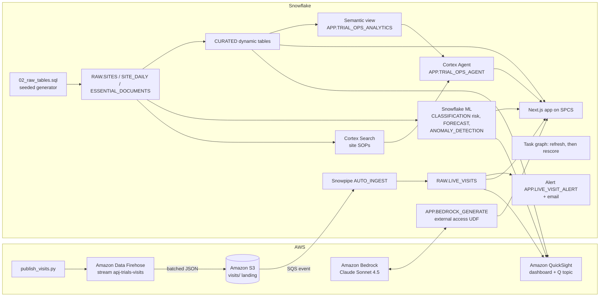

# APJ Clinical Trial Site Operations - Enrollment and Risk-Based Monitoring

End-to-end site operations for **40 trial sites in a fictional multi-site trial portfolio across 5 APJ markets** (Singapore, Sydney, Seoul, Tokyo, Taipei) using Snowflake, optionally with AWS: from a live visit-record alert to a 7-day important-deviation risk score, an alert email and an AI action memo for the clinical operations team. All data is synthetic and site-level: there are no patient records and no clinical outcomes.

## Architecture

A clinical operations pipeline built on **Snowflake** (Dynamic Tables, Snowflake ML, Cortex Search, Cortex Agent, Cortex AI_COMPLETE, SPCS) and, in the full build, **AWS** (Amazon Data Firehose, S3, Bedrock Claude, QuickSight + Amazon Q). Site visit-record events land in `RAW.LIVE_VISITS`. Dynamic tables curate 90 days of site-day history: participants screened and enrolled against plan, central-monitoring signals, confirmed important protocol deviations, CAPAs, monitoring visit compliance and essential document coverage. Snowflake ML scores 7-day important-deviation risk per site, forecasts portfolio enrollment and flags data query rate anomalies. A Cortex Agent answers questions with SOP citations, and an LLM drafts the clinical operations action memo.

Interactive diagrams (hover for object names): [Snowflake only](docs/architecture-snowflake.html) | [AWS + Snowflake](docs/architecture-aws.html). The app shows both on its Architecture & Data tab, the current build first. Regenerate them with `python3 docs/build_architecture.py`.


```mermaid
flowchart LR
    subgraph AWS
      SIM[publish_visits.py] --> FH[Amazon Data Firehose<br/>stream apj-trials-visits]
      FH -->|batched JSON| S3[(Amazon S3<br/>visits/ landing)]
      BR[Amazon Bedrock<br/>Claude Sonnet 4.5]
      QS[Amazon QuickSight<br/>dashboard + Q topic]
    end
    subgraph Snowflake
      S3 -->|SQS event| PIPE[Snowpipe AUTO_INGEST] --> LIVE[RAW.LIVE_VISITS]
      GEN[02_raw_tables.sql<br/>seeded generator] --> RAW[RAW.SITES / SITE_DAILY / ESSENTIAL_DOCUMENTS]
      RAW --> DT[CURATED dynamic tables]
      RAW --> ML[Snowflake ML<br/>CLASSIFICATION risk, FORECAST,<br/>ANOMALY_DETECTION]
      DT --> SV[Semantic view<br/>APP.TRIAL_OPS_ANALYTICS]
      RAW --> CS[Cortex Search<br/>site SOPs]
      SV --> AG[Cortex Agent<br/>APP.TRIAL_OPS_AGENT]
      CS --> AG
      LIVE --> AL[Alert APP.LIVE_VISIT_ALERT<br/>+ email]
      UDF[APP.BEDROCK_GENERATE<br/>external access UDF]
      TK[Task graph: refresh, then rescore]
      APP[Next.js app on SPCS]
    end
    BR <--> UDF
    DT --> APP
    ML --> APP
    LIVE --> APP
    AG --> APP
    UDF --> APP
    DT --> QS
    ML --> QS
    LIVE --> QS
```

The Snowflake-only build drops the AWS subgraph: `APP.SIMULATE_VISITS` writes to `RAW.LIVE_VISITS`, and the app calls Cortex `AI_COMPLETE` instead of the Bedrock UDF.

## Snowflake Capabilities

| Capability | Implementation |
|-----------|---------------|
| Dynamic Tables | `CURATED.KPI_SUMMARY`, `PERFORMANCE_SUMMARY`, `SIGNAL_SUMMARY`, `TREND_ANALYSIS` from the RAW tables |
| Snowflake ML | CLASSIFICATION 7-day important-deviation risk (`ML.DEVIATION_RISK_SCORES`), 14-day enrollment FORECAST, data query rate ANOMALY_DETECTION |
| Cortex Search | 14 synthetic site-management SOPs (one per therapeutic area and monitoring signal type) in `SEARCH.SITE_SOP_SEARCH` |
| Semantic View | `APP.TRIAL_OPS_ANALYTICS` over sites, signal types, daily totals and risk |
| Cortex Agent | `APP.TRIAL_OPS_AGENT`: Cortex Analyst over the semantic view plus Cortex Search for SOP citations |
| Cortex AI | `AI_COMPLETE('claude-sonnet-4-5')` for grounded answers, and for the action memo in the Snowflake-only build |
| Alerts + Tasks | `APP.LIVE_VISIT_ALERT` logs ALERT events and sends email; task graph `TASK_REFRESH_CURATED`, then `TASK_RESCORE_RISK` |
| Snowpark Container Services | Next.js app `APP.APJ_TRIALS_APP` with 6 tabs: Executive Cockpit, Predictive, Site Monitoring, Live Visits, Ask AI, Architecture & Data |
| Snowpipe | `RAW.LIVE_VISITS_PIPE` AUTO_INGEST from S3 (AWS build only) |

## AWS Services

Used only in the AWS + Snowflake build.

| Service | Role in Demo |
|---------|-------------|
| Amazon Data Firehose | Direct PUT stream `apj-trials-visits` receives simulated site visit-record events and writes batches to S3 |
| Amazon S3 | Landing bucket (`visits/`). An event notification goes to the Snowpipe SQS queue |
| Amazon Bedrock | Claude Sonnet 4.5 writes the action memo, called from Snowflake through an external-access UDF |
| Amazon QuickSight | DIRECT_QUERY executive dashboard over Snowflake (daily enrollment and signals, important deviations by site, deviation risk) |
| Amazon Q | Natural-language questions over the QuickSight topic `apj-trials-topic` |
| AWS IAM | Least-privilege roles for S3, Firehose and Bedrock |

## Personas

These personas are fictional.

| Persona | Role | Key Questions |
|---------|------|---------------|
| **Mei Tan** | Head of Clinical Operations | "Are we enrolling to plan?" "Which signal types turn into important deviations?" |
| **Arjun Rao** | Central Monitoring Lead | "Which sites are high risk this week, and which SOP applies?" |

## Data

All data is synthetic and seeded, so every rebuild reproduces it. The trial portfolio, sites and names are fictional. Tables hold site-level daily counts only: there are no patient records, no patient identifiers and no clinical outcomes, and nothing in this demo is a clinical, safety or efficacy claim.

| Table | Rows | Description |
|-------|------|-------------|
| RAW.SITES | 40 | Trial sites across 5 markets and 5 therapeutic areas (Oncology, Cardiology, Respiratory, Neurology, Metabolic), with monitoring tier and 90-day enrollment plan |
| RAW.SITE_DAILY | 3,600 | Daily site observations over 90 days: participants screened and enrolled, monitoring signals, confirmed important deviations, CAPAs, signal type, monitoring visits, data query rate and data-entry lag |
| RAW.ESSENTIAL_DOCUMENTS | 40 | Required, on-file and pending essential documents per site |
| SEARCH.SITE_SOP_DOCS | 14 | Synthetic site-management SOPs indexed for Cortex Search |
| RAW.LIVE_VISITS | Grows during the demo | Live visit-record events from Firehose (AWS build) or `APP.SIMULATE_VISITS` (Snowflake-only build) |
| ML.DEVIATION_RISK_SCORES | 40 | 7-day important-deviation probability and risk band per site |

## Build Instructions

### Prerequisites
- Snowflake account with ACCOUNTADMIN access, and Cortex AI enabled (AI_COMPLETE, Search, Agent).
- An X-Small warehouse with auto-suspend at or below 120 s, and an existing SPCS compute pool.
- Python 3.11+, `snowflake-connector-python`, Node.js 22+, Docker and the `snow` CLI.
- App image: run `snow spcs image-registry login`, then build and push `apj-trials-app:v1` to the database's `APP.IMAGES` repository (see the header of `snowflake/07_deploy_app.sql`).
- AWS build only: `boto3`, AWS credentials for the target account (us-west-2) with Bedrock access, and QuickSight Enterprise.

### SPCS App
```
<DATABASE>.APP.APJ_TRIALS_APP
```

### Tests
```bash
python -m pytest aws snowflake quicksight
```

For a local run, put `SNOWFLAKE_ACCOUNT`, `SNOWFLAKE_USER`, `SNOWFLAKE_DATABASE`, `SNOWFLAKE_WAREHOUSE`, `SNOWFLAKE_AUTHENTICATOR=PROGRAMMATIC_ACCESS_TOKEN`, `SNOWFLAKE_TOKEN` and `DEMO_PLATFORM` in the environment, then run `npm --prefix app run build && npm --prefix app start`.

## Build Modes

Both modes share the same core. They differ in three places, and the app's `DEMO_PLATFORM` setting (in its SPCS spec) switches the memo provider and the Live Visits tab.

| Layer | Snowflake Only | Full AWS + Snowflake |
|---|---|---|
| Live visit records | `CALL APP.SIMULATE_VISITS(n)` inserts simulated visit-record events into `RAW.LIVE_VISITS`. This simulates an EDC feed; it is not Snowpipe Streaming | `aws/publish_visits.py` to Amazon Data Firehose, then S3, SQS and Snowpipe AUTO_INGEST |
| Action memo | Cortex `AI_COMPLETE('claude-sonnet-4-5')` | Amazon Bedrock Claude Sonnet 4.5 through `APP.BEDROCK_GENERATE` |
| BI and natural-language questions | The SPCS app is the dashboard; questions go to the Cortex Agent | Also a QuickSight dashboard and an Amazon Q topic |
| App setting | `DEMO_PLATFORM: snowflake` | `DEMO_PLATFORM: aws` |

### Snowflake Only

```bash
# 1. Core data and dynamic tables (guarded: new isolated database only)
python snowflake/run_core.py --database APJ_CLINICAL_TRIALS_SNOWFLAKE --warehouse <XS_WAREHOUSE> --connection <CONNECTION> --apply
# 2. Native visit-record feed, ML, search, semantic view, agent, alert and task graph
python snowflake/run_intelligence.py --database APJ_CLINICAL_TRIALS_SNOWFLAKE --platform snowflake --warehouse <XS_WAREHOUSE> --connection <CONNECTION> --alert-email you@example.com
# 3. App on SPCS with DEMO_PLATFORM=snowflake (push the image first)
python snowflake/run_intelligence.py --database APJ_CLINICAL_TRIALS_SNOWFLAKE --platform snowflake --warehouse <XS_WAREHOUSE> --connection <CONNECTION> --alert-email you@example.com --files 07_deploy_app.sql --compute-pool <COMPUTE_POOL>
```

During the demo:
- Run `CALL APP.SIMULATE_VISITS(20)` to add live visit-record events. For a continuous feed, run `ALTER TASK APP.TASK_SIMULATE_VISITS RESUME`, and `SUSPEND` it afterwards.
- Run `EXECUTE ALERT APP.LIVE_VISIT_ALERT` to raise the alert email.
- Run `EXECUTE TASK APP.TASK_REFRESH_CURATED` to refresh the curated tables and rescore risk.

Afterwards, drop the database or run `ALTER SERVICE APP.APJ_TRIALS_APP SUSPEND`.

### Full AWS + Snowflake

```bash
# 1. Core data and dynamic tables (guarded: new isolated database only)
python snowflake/run_core.py --database APJ_CLINICAL_TRIALS_AWS --warehouse <XS_WAREHOUSE> --connection <CONNECTION> --apply
# 2. AWS ingestion and Bedrock (dry run first, then --apply)
python aws/setup_aws.py --database APJ_CLINICAL_TRIALS_AWS --account <AWS_ACCOUNT_ID> --connection <CONNECTION> --apply
# 3. ML, search, semantic view, agent, alert and task graph
python snowflake/run_intelligence.py --database APJ_CLINICAL_TRIALS_AWS --platform aws --warehouse <XS_WAREHOUSE> --connection <CONNECTION> --alert-email you@example.com
# 4. App on SPCS with DEMO_PLATFORM=aws (push the image first)
python snowflake/run_intelligence.py --database APJ_CLINICAL_TRIALS_AWS --platform aws --warehouse <XS_WAREHOUSE> --connection <CONNECTION> --alert-email you@example.com --files 07_deploy_app.sql --compute-pool <COMPUTE_POOL>
# 5. QuickSight dashboard and Q topic (needs an existing Snowflake data source)
python quicksight/build_dashboards.py --database APJ_CLINICAL_TRIALS_AWS --account <AWS_ACCOUNT_ID> --principal-arn <QUICKSIGHT_USER_ARN> --data-source-arn <DATA_SOURCE_ARN> --prefix apj-trials --apply --update --with-topic
```

QuickSight objects must be shared with the QuickSight user who signs in (`--principal-arn`); otherwise the console shows nothing.

During the demo:
- Run `python aws/publish_visits.py --count 20` to send live visit-record events. Firehose buffers for up to 60 seconds before writing to S3.
- Run `EXECUTE ALERT APP.LIVE_VISIT_ALERT` to raise the alert email.
- Run `EXECUTE TASK APP.TASK_REFRESH_CURATED` to refresh the curated tables and rescore risk.

Afterwards, `python aws/teardown_aws.py --database APJ_CLINICAL_TRIALS_AWS --account <AWS_ACCOUNT_ID> --connection <CONNECTION> --apply` removes the AWS resources and the account-level Bedrock external-access and S3 storage integrations. It leaves the email integration `APJ_TRIALS_EMAIL_INT`, which the Snowflake-only build also uses.

## Business Impact

Industry research and Snowflake customer outcomes:
- **A single day of delay in drug development** is worth approximately $800,000 in unrealized or lost prescription drug sales and $40,000 in direct daily clinical trial costs -- [Tufts CSDD, Quantifying the Value of a Day of Delay in Drug Development](https://csdd.tufts.edu/sites/default/files/2025-02/Aug2024%20Day%20of%20Delay%20White%20Paper%20Final.pdf)
- **Sanofi** (Snowflake customer) moved its real-world clinical data analytics engine from a managed Spark solution to Snowpark: 50% improvement in performance, and 100M patient records per cohort processed in four minutes on average -- [Snowflake customer story: Sanofi](https://www.snowflake.com/en/customers/all-customers/case-study/sanofi/)

## Key Demo Numbers

These figures are synthetic and come from the seeded demo data. Forecast and anomaly figures can shift slightly with the build day.

- **40 sites**, 3,600 site-days over 90 days, across 5 markets and 5 therapeutic areas
- **5,109 participants enrolled** against a plan of 5,634, so enrollment is at **90.7% of plan**; 6 sites are below 80% of plan. 7,044 screened, a 27.5% screen failure rate
- **593 monitoring signals** raised and **165 confirmed** as important deviations, a 27.8% signal confirmation rate; **83 CAPAs** opened
- **Visit window** produces the most important deviations (51 of 190 signals); the 16 regional EDC outage signals are never confirmed
- **Important-deviation model** out-of-time holdout: precision 0.44, recall 0.29 at a 0.5 threshold, against a 0.23 base rate. Seven sites are high risk; the top site is SITE-0002, at 81.4%
- **14-day enrollment forecast** of 48 to 66 participants per day, with prediction intervals; **36 of 640** site-days flagged as data query rate anomalies
- **Monitoring visit compliance 76.8%**, essential document coverage 60.0%, with 24 documents pending
- **14 SOPs** indexed for Cortex Search and cited by ID in agent answers

## License

Apache 2.0 — See [LICENSE](LICENSE) for details.

This is a personal demo project and is not an official Snowflake offering. It comes with no support or warranty. It uses synthetic data only and provides no medical, clinical or regulatory advice. Industry metrics cited are from publicly available third-party research and Snowflake customer stories; they represent reported outcomes and are not guarantees of results.
